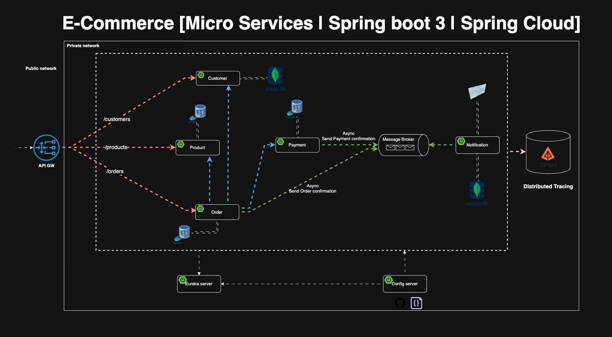

# E-Commerce Microservice

A distributed e-commerce platform built with Java, Spring Boot, Kafka, and Maildev.



## Overview

This project implements a scalable microservice architecture for an e-commerce platform using:
- **Java & Spring Boot** - Backend framework
- **Kafka** - Asynchronous messaging and event streaming
- **Maildev** - Email service for development
- **Service Discovery** - Eureka for service registry
- **API Gateway** - Spring Cloud Gateway for routing
- **Config Server** - Centralized configuration management

## Architecture

The system consists of the following microservices:

- **Config Server** - Centralized configuration management
- **Discovery Service** - Eureka service registry
- **Gateway** - API Gateway for request routing
- **Customer Service** - Customer management and profiles
- **Product Service** - Product catalog and inventory
- **Order Service** - Order processing and management
- **Payment Service** - Payment processing
- **Notification Service** - Email and notification handling

## Getting Started

### Prerequisites

- Java 11 or higher
- Maven 3.6+
- Docker and Docker Compose
- Git

### Installation

1. Clone the repository:
```bash
git clone <repository-url>
cd e-commerce-microservice
```

2. Start all services using Docker Compose:
```bash
docker-compose up -d
```

3. Build the project:
```bash
mvn clean install
```

## Building and Running

### Build Individual Service
```bash
cd services/<service-name>
mvn clean install
```

### Run Individual Service
```bash
cd services/<service-name>
mvn spring-boot:run
```

### Access Services

- **API Gateway**: http://localhost:8080
- **Discovery Service**: http://localhost:8761
- **Config Server**: http://localhost:8888
- **Maildev**: http://localhost:1080

## Configuration

Each service has its own configuration file in `services/<service-name>/src/main/resources/application.yml`. Configuration can also be managed through the Config Server.

### Common Properties
- Server port
- Database connection
- Kafka topics and brokers
- Service discovery settings

## Kafka Topics

The following Kafka topics are used for async communication:

- `order-events` - Order creation and updates
- `payment-events` - Payment processing events
- `notification-events` - Email notifications
- `inventory-events` - Stock updates

## Testing

Run tests for all services:
```bash
mvn test
```

Run tests for a specific service:
```bash
cd services/<service-name>
mvn test
```

## API Documentation

API endpoints are documented using Swagger/Springdoc. Access the documentation at:
- http://localhost:8080/swagger-ui.html (via Gateway)

## Docker Compose

Start the entire stack:
```bash
docker-compose up -d
```

Stop the stack:
```bash
docker-compose down
```

View logs:
```bash
docker-compose logs -f
```

## Database

Each microservice may have its own database. Refer to individual service documentation for DB configuration.

## Contributing

1. Create a new branch for your feature
2. Commit your changes
3. Push to the repository
4. Create a Pull Request

## License

This project is licensed under the MIT License - see the LICENSE file for details.

## Author

Created and maintained by the development team.

---

**Status**: Under Development

For more information, refer to individual service documentation in their respective folders.
